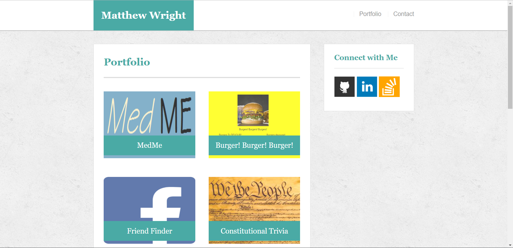

# :white_check_mark: Matthew Wright-Portfolio

### Overview

This is a basic portfolio site I built that demostrates front-end development skills.  It was the first project I completed at the University of Pennsylvania coding boot camp.  The CSS was tricky, and as I learned more about it I have made some updates to improve the look of the site.  As I have built more apps, I have added them to the portfolio page.

### Functionality
This is a basic HTML & CSS app.  There is a nav bar at the top that directs the user to the 3 main HTML pages:
  1. <strong>Home</strong> Provides short biographical information.
  2. <strong>Portfolio</strong> Lists my completed projects with a link to GutHub
   
  3. <strong>Contact</strong> Gives my contact information including a link to me email address

### Screenshot

